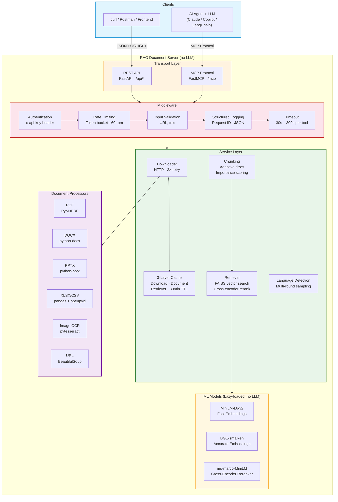

# RAG Document Server v2.0

**Pure deterministic tool server** for document processing, chunking, and
vector retrieval. **No LLM inside** — bring your own agent.

Two access modes:

- **REST API** — plain HTTP JSON endpoints, works with any HTTP client
- **MCP** — Model Context Protocol for AI agent integration (Claude, Copilot, LangChain, etc.)

```
  Any HTTP client                 AI Agent (Claude / Copilot / LangChain)
  (curl, Postman, frontend)       │  MCP protocol
       │  REST JSON                ▼
       ▼                   ┌──────────────────────────────┐
┌─────────────────────┐    │  MCP Server                  │
│  REST API (FastAPI)  │    │  (streamable-http · stdio)   │
│  localhost:8000/api  │    │  localhost:8000/mcp          │
└────────┬────────────┘    └──────────┬───────────────────┘
         │                            │
         └──────────┬─────────────────┘
                    ▼
┌──────────────────────────────────────────────────────┐
│             Shared Service Layer                     │
│  ┌────────────┐  ┌──────────────┐  ┌─────────────┐  │
│  │ Middleware  │→ │  Services    │→ │ Processors  │  │
│  │ auth, rate │  │ cache, chunk │  │ PDF, DOCX,  │  │
│  │ limit, log │  │ download,    │  │ PPTX, XLSX, │  │
│  │ timeout    │  │ retrieval    │  │ CSV, Image   │  │
│  └────────────┘  └──────────────┘  └─────────────┘  │
│                                                      │
│  Models: MiniLM · BGE · Cross-Encoder (no LLM)      │
└──────────────────────────────────────────────────────┘
```

---

## Architecture Diagram



---

## Table of Contents

1.  [Quick Start](#quick-start)
2.  [Client Agent](#client-agent)
3.  [REST API Reference](#rest-api-reference)
4.  [MCP Tools Reference](#mcp-tools-reference)
5.  [Project Structure](#project-structure)
6.  [Configuration Deep Dive](#configuration-deep-dive)
7.  [Security & Middleware Pipeline](#security--middleware-pipeline)
8.  [Caching Architecture](#caching-architecture)
9.  [Document Processors — Internals](#document-processors--internals)
10. [Adaptive Chunking Algorithm](#adaptive-chunking-algorithm)
11. [Retrieval Engine](#retrieval-engine)
12. [Lazy Model Loading](#lazy-model-loading)
13. [Structured Logging](#structured-logging)
14. [Error Hierarchy](#error-hierarchy)
15. [Data Schemas](#data-schemas)
16. [Language Detection](#language-detection)
17. [Supported Formats](#supported-formats)
18. [Environment Variables](#environment-variables)
19. [Client Configuration Examples](#client-configuration-examples)
20. [Development Guide](#development-guide)

---

## Quick Start

### 1. Install dependencies

```bash
pip install -r requirements.txt
```

> **Key packages:** `mcp[cli]>=1.26.0`, `fastapi`, `uvicorn`, `langchain-huggingface`,
> `langchain-community`, `sentence-transformers`, `torch`, `PyMuPDF`, `python-docx`,
> `python-pptx`, `openpyxl`, `pandas`, `pytesseract`, `beautifulsoup4`, `faiss-cpu`
> (or `faiss-gpu` for CUDA acceleration).

### 2. Set environment variables

```bash
# Optional security
export MCP_API_KEY="your-secret-key"         # enables auth
export MCP_RATE_LIMIT_RPM="60"               # requests per minute
export MCP_REQUEST_TIMEOUT="300"             # seconds per tool call
```

> **Note:** No `GOOGLE_API_KEY` is needed for the server — it contains no LLM.
> LLM keys are only needed in the [client agent](#client-agent).

### 3. Start the server

```bash
# ── REST API (for backend / direct HTTP usage) ────────────────────
python -m mcp_server --transport rest                    # localhost:8000
python -m mcp_server --transport rest --host 0.0.0.0 --port 9000

# ── MCP transport (for AI agent integration) ──────────────────────
python -m mcp_server                                     # streamable-http, localhost:8000
python -m mcp_server --transport stdio                   # stdio (piped)
```

| CLI Argument    | Choices                                 | Default              |
|-----------------|-----------------------------------------|----------------------|
| `--transport`   | `streamable-http`, `stdio`, `rest`      | `streamable-http`    |
| `--host`        | Any bind address                        | `127.0.0.1`          |
| `--port`        | Any port number                         | `8000`               |

### 4. Verify

```powershell
# REST mode — PowerShell
Invoke-RestMethod -Uri http://127.0.0.1:8000/api/health

# List all available endpoints
Invoke-RestMethod -Uri http://127.0.0.1:8000/
```

```bash
# REST mode — curl
curl http://127.0.0.1:8000/api/health
curl http://127.0.0.1:8000/
```

---

## Client Agent

The `client/` folder contains a **separate process** — a LangChain-powered
ReAct agent that connects to the running MCP server and uses its tools with
its own LLM (Gemini, OpenAI, etc.). All reasoning happens in the client;
the server is just a tool provider.

```bash
cd client
pip install -r requirements.txt
cp .env.example .env       # add your GOOGLE_API_KEY or OPENAI_API_KEY
python agent.py            # interactive REPL mode
python agent.py "Summarise https://example.com/report.pdf"  # one-shot
```

```
┌────────────────────┐    MCP (streamable-http)    ┌──────────────────────┐
│  client/agent.py   │ ◄────────────────────────► │  MCP Server          │
│                    │                             │  (pure tools)        │
│  • LLM (Gemini)   │   tool calls:               │  • extract_pdf_text  │
│  • ReAct agent     │   – process_document        │  • chunk_document    │
│  • Reasoning       │   – retrieve_chunks         │  • retrieve_chunks   │
│  • Answers         │   – detect_language  …      │  • FAISS + rerank    │
└────────────────────┘                             └──────────────────────┘
```

See [`client/README.md`](client/README.md) for full details on the agent
architecture, LLM selection, environment variables, and example conversations.

---

## REST API Reference

All endpoints accept/return JSON. The REST layer (`api.py`) is a thin
FastAPI wrapper that delegates directly to the same service functions used
by the MCP tools. CORS is enabled for all origins. Interactive Swagger docs
are available at `http://127.0.0.1:8000/docs`.

### HTTP Middleware (applied to every request)

1. **Request ID** — `uuid4().hex[:12]` generated and returned as `X-Request-Id` header
2. **API Key** — checked via `x-api-key` header → HTTP 401 on mismatch
3. **Rate Limit** — token-bucket → HTTP 429 when exhausted

### Document Endpoints

| Method | Endpoint | Request Body | Description |
|--------|----------|--------------|-------------|
| `POST` | `/api/process-document` | `{"document_url": "..."}` | Extract text, tables, images, URLs from any document |
| `POST` | `/api/chunk-document` | `{"document_url": "..."}` | Split document into scored, RAG-ready chunks |
| `POST` | `/api/retrieve-chunks` | `{"document_url": "...", "query": "...", "top_k": 5}` | Vector search (FAISS + reranking) for relevant chunks |

### Extraction Endpoints

| Method | Endpoint | Request Body | Description |
|--------|----------|--------------|-------------|
| `POST` | `/api/extract/pdf` | `{"document_url": "..."}` | PDF text with layout preservation |
| `POST` | `/api/extract/docx` | `{"document_url": "..."}` | DOCX text with headings & tables |
| `POST` | `/api/extract/pptx` | `{"document_url": "..."}` | PPTX slides, notes, tables |
| `POST` | `/api/extract/xlsx` | `{"document_url": "..."}` | XLSX multi-sheet table extraction |
| `POST` | `/api/extract/csv` | `{"document_url": "..."}` | CSV tabular content extraction |
| `POST` | `/api/extract/image` | `{"document_url": "..."}` | Image OCR (pytesseract) |

### Utility Endpoints

| Method | Endpoint | Request Body | Description |
|--------|----------|--------------|-------------|
| `POST` | `/api/detect-language` | `{"text": "..."}` | Multi-round language detection |
| `GET`  | `/api/health` | — | System health, models, capabilities |
| `POST` | `/api/cache` | `{"action": "stats"\|"clear"}` | Cache stats or clear |
| `GET`  | `/` | — | List all available endpoints |

### Example Requests

```powershell
# Health check
Invoke-RestMethod -Uri http://127.0.0.1:8000/api/health

# Process a document (extract everything)
Invoke-RestMethod -Uri http://127.0.0.1:8000/api/process-document `
  -Method POST -ContentType "application/json" `
  -Body '{"document_url":"https://example.com/report.pdf"}'

# Chunk a document (RAG-ready pieces)
Invoke-RestMethod -Uri http://127.0.0.1:8000/api/chunk-document `
  -Method POST -ContentType "application/json" `
  -Body '{"document_url":"https://example.com/report.pdf"}'

# Retrieve relevant chunks via vector search
Invoke-RestMethod -Uri http://127.0.0.1:8000/api/retrieve-chunks `
  -Method POST -ContentType "application/json" `
  -Body '{"document_url":"https://example.com/report.pdf","query":"What are the key findings?","top_k":5}'

# Extract PDF text
Invoke-RestMethod -Uri http://127.0.0.1:8000/api/extract/pdf `
  -Method POST -ContentType "application/json" `
  -Body '{"document_url":"https://example.com/report.pdf"}'

# Extract CSV tables
Invoke-RestMethod -Uri http://127.0.0.1:8000/api/extract/csv `
  -Method POST -ContentType "application/json" `
  -Body '{"document_url":"https://example.com/data.csv"}'

# Detect language
Invoke-RestMethod -Uri http://127.0.0.1:8000/api/detect-language `
  -Method POST -ContentType "application/json" `
  -Body '{"text":"Bonjour, comment allez-vous?"}'
```

```bash
# curl equivalents
curl http://127.0.0.1:8000/api/health

curl -X POST http://127.0.0.1:8000/api/retrieve-chunks \
  -H "Content-Type: application/json" \
  -d '{"document_url":"https://example.com/report.pdf","query":"key findings","top_k":5}'
```

### Authentication (REST)

If `MCP_API_KEY` is set, every request must include the key:

```powershell
Invoke-RestMethod -Uri http://127.0.0.1:8000/api/health `
  -Headers @{ "x-api-key" = "your-secret-key" }
```

```bash
curl http://127.0.0.1:8000/api/health -H "x-api-key: your-secret-key"
```

### Response Envelope

All tool responses follow a consistent structure. On success (example for `process_document`):

```json
{
  "content": "extracted text...",
  "content_length": 12345,
  "metadata": { "source": "...", "doc_type": "pdf" },
  "tables": [],
  "images": [],
  "urls": [],
  "detected_language": "en",
  "detected_language_name": "English"
}
```

On error (tools never raise — all exceptions are caught):

```json
{
  "error": "Rate limit exceeded",
  "code": "RATE_LIMITED"
}
```

---

## MCP Tools Reference

### Document Tools

| # | Tool | Input | Output | Timeout |
|---|------|-------|--------|---------|
| 1 | `process_document` | `document_url: str` | `{content (≤50K chars), content_length, metadata, tables[], images[], urls[], detected_language, detected_language_name}` | 300 s |
| 2 | `chunk_document` | `document_url: str` | `{chunks[{text (≤5K), chunk_index, total_chunks, importance_score, content_type}], chunk_count, document_type}` | 300 s |
| 3 | `retrieve_chunks` | `document_url: str, query: str, top_k: int (1–20, default 5)` | `{results[{text, chunk_index, importance_score, content_type}], total_chunks_indexed}` | 300 s |

**`retrieve_chunks` internal pipeline:**
1. Downloads document → processes it → chunks it adaptively
2. Selects embedding model (accurate if <100 chunks, fast otherwise)
3. Builds a FAISS vector index from all chunks
4. Runs similarity search with 3× over-retrieval (up to 20 candidates)
5. Reranks with cross-encoder (if available)
6. Applies diversity filter (favours unseen content types)
7. Returns `top_k` best chunks
8. Caches both the processed document and the FAISS retriever (keyed by `sha256(url)[:16]`)

### Extraction Tools

| # | Tool | Input | Output | Timeout |
|---|------|-------|--------|---------|
| 4 | `extract_pdf_text` | `document_url: str` | `{text (≤50K chars), char_count}` | 120 s |
| 5 | `extract_docx_text` | `document_url: str` | `{text (≤50K chars), char_count}` | 120 s |
| 6 | `extract_pptx_text` | `document_url: str` | `{text (≤50K chars), char_count}` | 120 s |
| 7 | `extract_xlsx_tables` | `document_url: str` | `{tables[{content (≤5K), table_type, location, metadata}], table_count}` | 120 s |
| 8 | `extract_csv_tables` | `document_url: str` | `{tables[{content (≤5K), table_type, location, metadata}], table_count}` | 120 s |
| 9 | `extract_image_text` | `image_url: str` | `{ocr_results[{text, confidence, metadata}]}` | 120 s |

### Utility Tools

| # | Tool | Input | Output | Timeout |
|---|------|-------|--------|---------|
| 10 | `detect_language` | `text: str` | `{language_code, language_name}` | 30 s |
| 11 | `get_system_health` | (none) | Full health report: status, version, features, security, models, formats, device, cache stats, timestamp | 30 s |
| 12 | `manage_cache` | `action: str ("stats" / "clear")` | Cache statistics per layer or eviction counts | 30 s |

### MCP Resources

| URI | Description |
|-----|-------------|
| `rag://supported-formats` | Human-readable list of all supported document formats |
| `rag://tool-descriptions` | Summary of all 12 tools and their parameters |

---

## Project Structure

```
├── README.md
├── requirements.txt             # Server dependencies (no LLM)
├── .env.example                 # Example environment variables
├── .gitignore
├── LICENSE                      # MIT
│
├── mcp_server/                  # ─── Server package ───
│   ├── __init__.py
│   ├── __main__.py              # CLI: --transport rest|streamable-http|stdio
│   ├── server.py                # FastMCP instance, lifespan, tool registration
│   ├── api.py                   # FastAPI REST wrapper (plain JSON endpoints)
│   │
│   ├── core/
│   │   ├── config.py            # Frozen dataclass configs, feature flags, device detection
│   │   ├── logging.py           # Structured JSON logging to stderr, request-id ContextVar
│   │   ├── errors.py            # Exception hierarchy (6 error types)
│   │   ├── schemas.py           # ProcessedDocument, ExtractedTable, ExtractedImage, ExtractedURL
│   │   └── models.py            # Lazy-loaded ML models (embeddings + reranker only)
│   │
│   ├── middleware/
│   │   ├── __init__.py          # @guarded() decorator — full middleware chain
│   │   └── guards.py            # Auth, token-bucket rate-limit, URL/text validation
│   │
│   ├── services/
│   │   ├── cache.py             # Generic _TTLCache, 3 singleton layers
│   │   ├── downloader.py        # HTTP download with 3× retry + backoff
│   │   ├── language.py          # Multi-round majority-vote language detection
│   │   ├── chunking.py          # Adaptive chunking strategy + importance scoring
│   │   └── retrieval.py         # FAISS vector search + cross-encoder reranking + diversity filter
│   │
│   ├── processors/
│   │   ├── __init__.py          # detect_document_type(), TargetedDocumentProcessor dispatcher
│   │   ├── pdf.py               # PyMuPDF — dict-based extraction with layout preservation
│   │   ├── docx.py              # python-docx — heading hierarchy + table extraction
│   │   ├── pptx.py              # python-pptx — slides, notes, tables, hyperlinks
│   │   ├── xlsx.py              # pandas + openpyxl — header detection, column analysis; also CSV
│   │   ├── image.py             # pytesseract — per-word OCR with confidence scores
│   │   └── url.py               # Regex URL extraction with context + categorisation
│   │
│   ├── tools/
│   │   ├── query.py             # process_document, chunk_document, retrieve_chunks
│   │   ├── extract.py           # Per-format extraction (PDF, DOCX, PPTX, XLSX, CSV, Image)
│   │   └── utility.py           # detect_language, get_system_health, manage_cache
│   │
│   ├── resources/
│   │   └── __init__.py          # rag://supported-formats, rag://tool-descriptions
│   │
│   ├── temp_files/              # Auto-created — temporary download / OCR staging
│   └── request_logs/            # Auto-created — structured request logs
│
└── client/                      # ─── Separate agent (has LLM) ───
    ├── README.md
    ├── requirements.txt         # langchain, langchain-google-genai, langchain-mcp-adapters
    ├── .env.example
    └── agent.py                 # LangChain ReAct agent connecting via MCP
```

---

## Configuration Deep Dive

All configuration lives in `core/config.py` as **frozen dataclasses** (immutable
singletons created at import time). No `.yaml` or `.toml` — just Python constants
with optional environment variable overrides for security settings.

### Path Constants

| Constant | Value | Purpose |
|----------|-------|---------|
| `BASE_DIR` | Parent of `mcp_server/` package | Root path for temp/log dirs |
| `TEMP_FILES_PATH` | `<BASE_DIR>/temp_files/` | Temporary downloads, OCR staging |
| `REQUEST_LOGS_PATH` | `<BASE_DIR>/request_logs/` | Structured request logs |

Both directories are auto-created on import if they don't exist.

### Device Detection

Runs once at import time:

1. `torch.cuda.is_available()` → `"cuda"`
2. `torch.backends.mps.is_available()` → `"mps"` (Apple Silicon)
3. Falls back to `"cpu"` (including when `torch` is not installed)

### Feature Flags (Graceful Degradation)

| Flag | Dependency | Fallback |
|------|------------|----------|
| `RERANK_AVAILABLE` | `sentence_transformers.CrossEncoder` | Reranking skipped; similarity results returned as-is |
| `OCR_AVAILABLE` | `pytesseract` | OCR tools return an error message |
| `LANG_DETECT_AVAILABLE` | `langdetect` | Always defaults to `"en"` |

### Config Dataclasses

#### `ServerConfig`

| Field | Type | Default |
|-------|------|---------|
| `name` | `str` | `"RAG Document Server"` |
| `version` | `str` | `"2.0.0"` |
| `host` | `str` | `"127.0.0.1"` |
| `port` | `int` | `8000` |
| `transport` | `str` | `"streamable-http"` |

#### `ModelConfig`

| Field | Type | Default |
|-------|------|---------|
| `embedding_fast` | `str` | `"sentence-transformers/all-MiniLM-L6-v2"` |
| `embedding_accurate` | `str` | `"BAAI/bge-small-en-v1.5"` |
| `reranker` | `str` | `"cross-encoder/ms-marco-MiniLM-L-6-v2"` |

#### `CacheConfig`

| Field | Type | Default |
|-------|------|---------|
| `default_ttl` | `int` | `1800` (30 min) |
| `max_download_entries` | `int` | `50` |
| `max_document_entries` | `int` | `50` |
| `max_retriever_entries` | `int` | `20` |
| `max_download_bytes` | `int` | `524,288,000` (500 MB) |

#### `SecurityConfig`

| Field | Type | Default | Env Var |
|-------|------|---------|---------|
| `api_key` | `str` | `""` | `MCP_API_KEY` |
| `auth_enabled` | `bool` | `bool(os.getenv("MCP_API_KEY"))` | `MCP_API_KEY` |
| `rate_limit_rpm` | `int` | `60` | `MCP_RATE_LIMIT_RPM` |
| `max_url_length` | `int` | `2048` | — |
| `max_text_length` | `int` | `100,000` | — |
| `request_timeout` | `int` | `300` | `MCP_REQUEST_TIMEOUT` |

---

## Security & Middleware Pipeline

Every tool invocation (both MCP and REST) passes through the `@guarded(timeout=...)`
decorator. This decorator implements a **complete middleware chain** that ensures
tools never raise exceptions to the client.

### Middleware Steps (in order)

```
Request → [1] Request ID → [2] Auth → [3] Rate Limit → [4] Execute w/ Timeout → [5] Log → Response
```

1. **Request ID Generation** — `uuid4().hex[:12]` stored in a `ContextVar` for log
   correlation across the entire call stack.

2. **Authentication** (`check_auth()`) — if `SecurityConfig.auth_enabled` is `True`,
   verifies the API key. Raises `AuthenticationError` on failure.

3. **Rate Limiting** (`check_rate_limit(tool_name)`) — token-bucket algorithm:
   - Capacity = `rate_limit_rpm` (default 60)
   - Refill rate = `rpm / 60.0` tokens per second
   - Lazy refill: tokens refill on each `consume()` call (no background thread)
   - Raises `RateLimitError` when tokens exhausted

4. **Execution with Timeout** — `asyncio.wait_for(fn(...), timeout=...)`:
   - Document tools: 300 s
   - Extraction tools: 120 s
   - Utility tools: 30 s
   - Raises `TimeoutError` (caught by the decorator, returned as `{"code": "TIMEOUT"}`)

5. **Structured Logging** — emits `tool.start`, `tool.success` (with elapsed time),
   or `tool.timeout` / `tool.known_error` / `tool.unhandled_error` events.

6. **Error Conversion** — all exceptions are caught and converted to error dicts:
   - `MCPServerError` subclass → `{"error": exc.message, "code": exc.code}`
   - `asyncio.TimeoutError` → `{"error": "...", "code": "TIMEOUT"}`
   - Any other `Exception` → `{"error": "...", "code": "INTERNAL_ERROR"}`
   - `request_id_var.reset(token)` in `finally` block

### Input Validation

| Validator | Rules | Raises |
|-----------|-------|--------|
| `validate_url(url)` | Non-empty string, ≤ 2048 chars, `^https?://[safe-url-chars]+$` | `ValidationError` |
| `validate_text(text, field)` | Must be a string, ≤ 100,000 chars | `ValidationError` |

---

## Caching Architecture

The cache system uses a generic `_TTLCache` class — thread-safe (`threading.Lock`),
size-bounded, with time-based expiration. Each cache entry is a `_CacheEntry`
dataclass containing `value`, `expires_at` (float timestamp), and `size_bytes`.

### Three Cache Layers

| Layer | Key | Stores | TTL | Max Entries | Max Bytes |
|-------|-----|--------|-----|-------------|-----------|
| **Download** | URL string | Raw HTTP response bytes | 30 min | 50 | 500 MB |
| **Document** | `sha256(url)[:16]` | `ProcessedDocument` objects | 30 min | 50 | — |
| **Retriever** | `sha256(url)[:16]` | `EnhancedRetriever` (FAISS index + chunks) | 30 min | 20 | — |

### Eviction Algorithm

On every `put()` call, the following eviction sequence runs:

1. **Purge expired** — remove all entries where `now > expires_at`
2. **Update existing** — if the key already exists, evict it first
3. **Byte limit** — while `total_bytes > max_download_bytes`, evict oldest entry
4. **Entry limit** — while `len(cache) >= max_entries`, evict oldest entry
5. **"Oldest"** = entry with the smallest (earliest) `expires_at` value

### Cache Operations

```json
// Inspect cache statistics (per-layer hit/miss rates)
{"tool": "manage_cache", "arguments": {"action": "stats"}}

// Clear all three cache layers
{"tool": "manage_cache", "arguments": {"action": "clear"}}
```

### Public Cache API (internal use)

| Function | Purpose |
|----------|---------|
| `get_cached_download(url)` / `put_cached_download(url, data)` | Download layer |
| `get_cached_document(key)` / `put_cached_document(key, doc)` | Document layer |
| `get_cached_retriever(key)` / `put_cached_retriever(key, ret)` | Retriever layer |
| `clear_all()` | Flush all layers |
| `cache_stats()` | Per-layer hit count, miss count, hit rate %, entry count |

---

## Document Processors — Internals

### Dispatcher (`processors/__init__.py`)

**`detect_document_type(url)`** — parses the URL path and maps the file extension:

| Extension(s) | Type | Processor |
|--------------|------|-----------|
| `.pdf` | `"pdf"` | `extract_text_from_pdf()` |
| `.doc`, `.docx` | `"docx"` | `extract_text_from_docx()` |
| `.ppt`, `.pptx` | `"pptx"` | `extract_text_from_pptx()` |
| `.xls`, `.xlsx` | `"xlsx"` | `extract_tables_from_xlsx()` |
| `.csv` | `"csv"` | `extract_tables_from_csv()` |
| `.txt` | `"txt"` | UTF-8 decode |
| `.htm`, `.html` | `"html"` | WebBaseLoader → BeautifulSoup fallback |
| `.png`, `.jpg`, `.jpeg` | `"image"` | `extract_text_from_image()` |
| anything else | `"unknown"` | UTF-8 decode with `errors="replace"` |

**Fallback safety:** If any format-specific processor throws an exception, the
dispatcher catches it and falls back to raw `file_content.decode("utf-8", errors="replace")`.

After extraction, the dispatcher also:
- Extracts URLs from the text via `URLExtractor`
- Detects language via `detect_language_robust()`
- Returns a `ProcessedDocument` dataclass

### PDF Processor (`processors/pdf.py`)

- **Library:** PyMuPDF (`fitz`)
- **Primary extraction:** Dict-based with layout preservation — `page.get_text("dict", sort=True)`, reassembles text blocks with page markers `--- Page N ---`
- **Fallback 1:** Raw `page.get_text()` on any exception
- **Fallback 2:** Empty string if even raw extraction fails

### DOCX Processor (`processors/docx.py`)

- **Library:** `python-docx`
- **Heading hierarchy:** Preserves heading levels as Markdown `# heading`, `## heading`, etc.
- **Tables:** Extracted as pipe-separated Markdown tables `| cell | cell |`

### PPTX Processor (`processors/pptx.py`)

- **Library:** `python-pptx`
- **Per-slide extraction:** Title, body text (with bullet indentation levels), tables, speaker notes
- **Hyperlinks:** Extracted from both slide relationships and inline URLs

### XLSX Processor (`processors/xlsx.py`)

- **Library:** `pandas` + `openpyxl`
- **Header auto-detection:** Scans first 10 rows, scores each candidate by:
  - `uniqueness × 0.5` + `text_ratio × 0.3` + `coverage × 0.2`
- **Display limit:** Max 20 rows rendered per sheet
- **Column analysis:** Per-column data type inference (numeric if >80% digits, datetime by keyword, else text), data density calculation
- **Cross-sheet relationships:** Detects common columns across sheets

### CSV Processor (`processors/xlsx.py`)

- **Library:** `pandas`
- **Parsing:** `pd.read_csv()` with automatic header detection
- **Output:** Same formatting pipeline as XLSX (column analysis, type inference, etc.)

### Image Processor (`processors/image.py`)

- **Library:** `pytesseract` + `Pillow`
- **Pipeline:** Convert to RGB → save temp PNG → `image_to_data` for per-word confidence → filter `conf > 0` → compute mean confidence
- **Cleanup:** Temp file removed in `finally` block even on failure

### URL Extractor (`processors/url.py`)

- **Regex:** `https?://[^\s<>"']+` or `www.[^\s<>"']+.[^\s<>"']+`
- **Context:** 100 characters before and after the URL
- **Categorisation:** `api_endpoint`, `navigation`, `image`, or `general`
- **Confidence:** Hardcoded `0.9`

---

## Adaptive Chunking Algorithm

The chunking service (`services/chunking.py`) uses `AdaptiveChunkingStrategy` — a
set of static methods that determine optimal chunk parameters based on document
type and content length.

### Chunk Parameters by Document Type

| Doc Type | Chunk Size | Overlap | Separators |
|----------|-----------|---------|------------|
| `pdf` | 1500 | 300 | `\n\n`, `\n`, `. `, ` ` |
| `pptx` | 800 | 150 | `\n---\n`, `\n\n`, `\n`, `. `, ` ` |
| `xlsx` / `csv` | 1200 | 200 | `\n===`, `\n---`, `\n\n`, `\n`, ` ` |
| `docx` / `html` | 1500 | 300 | `\n\n`, `\n`, `. `, ` ` |
| Default | 1200 | 250 | `\n\n`, `\n`, `. `, ` ` |

### Dynamic Scaling Based on Content Length

| Content Length | Scaling |
|---------------|---------|
| > 100,000 chars | chunk_size × 1.5, overlap × 1.3 |
| < 5,000 chars | chunk_size ÷ 2 (min 400), overlap ÷ 2 (min 50) |
| 5,000 – 100,000 | No scaling |

### Importance Scoring Algorithm

Each chunk receives an importance score in `[0.0, 1.0]`:

| Condition | Score Delta |
|-----------|------------|
| Base score | `+0.5` |
| Headings detected (`^#{1,3}\s` or `^ALL-CAPS-LINE$`) | `+0.2` |
| Numbers/currency (`\d+\.?\d*%`, `$\d+`, `€\d+`) | `+0.15` |
| Keywords: `important`, `key`, `critical`, `summary`, `conclusion`, `result`, `finding`, `recommendation` | `+0.1` |
| Text length < 50 chars | `−0.2` |

Result is clamped to `[0.0, 1.0]` and rounded to 2 decimal places.

### Content Type Detection

Each chunk is classified as one of:

| Type | Detection Rule |
|------|---------------|
| `"table"` | Contains pipe `\|` characters or tabs |
| `"list"` | Contains bullet points (`- `, `• `, `* `) |
| `"heading"` | Matches markdown heading syntax |
| `"text"` | Default |

### Chunk Metadata

Each chunk carries: `chunk_index`, `total_chunks`, `importance_score`, `content_type`, `doc_type`.

The underlying splitter is LangChain's `RecursiveCharacterTextSplitter`.

---

## Retrieval Engine

The retrieval service (`services/retrieval.py`) implements `EnhancedRetriever` —
an on-the-fly FAISS vector search engine with cross-encoder reranking and
diversity filtering.

### Pipeline Steps

```
Chunks → Embedding → FAISS Index → Similarity Search (3× over-retrieval)
    → Cross-Encoder Reranking → Diversity Filter → top_k results
```

1. **Index Construction** — `FAISS.from_documents(chunks, embeddings)` from
   `langchain_community.vectorstores`. Built on every new document (cached
   in the retriever cache layer for subsequent queries).

2. **Embedding Model Selection:**
   - < 100 chunks → `get_embeddings_accurate()` (BGE-small-en-v1.5)
   - ≥ 100 chunks → `get_embeddings_fast()` (MiniLM-L6-v2) for performance

3. **Similarity Search** — `vectorstore.similarity_search(query, k=min(top_k * 3, 20))`.
   Fetches 3× the requested number of candidates (capped at 20).

4. **Cross-Encoder Reranking** (if `RERANK_AVAILABLE` and `use_reranking=True`):
   - Creates `[query, chunk_text]` pairs
   - Scores via `CrossEncoder.predict(pairs)` using `ms-marco-MiniLM-L-6-v2`
   - Sorts descending by score, takes `top_k`
   - **Fallback:** On any exception, logs a warning and falls back to truncated similarity results

5. **Diversity Filter** (`_diversity_filter`):
   - Sorts candidates by `importance_score` descending
   - Greedily selects chunks, favouring unseen `content_type` values
   - A chunk is always added if its `content_type` hasn't been seen yet, **or** if `len(selected) < top_k`
   - Stops at `top_k`

---

## Lazy Model Loading

All ML models (embeddings + reranker) are loaded **on first access**, not at
import time. This keeps server boot time under 2 seconds.

### Thread-Safe Double-Checked Locking

A module-level `_loaded` boolean is checked first (fast path), then re-checked
inside a `threading.Lock` (safe path). This ensures models are loaded exactly
once even under concurrent requests.

### Models

| Variable | Class | Model ID | Key Settings |
|----------|-------|----------|-------------|
| `_embeddings_fast` | `HuggingFaceEmbeddings` | `sentence-transformers/all-MiniLM-L6-v2` | `normalize_embeddings=True`, `batch_size=32`, auto device |
| `_embeddings_accurate` | `HuggingFaceEmbeddings` | `BAAI/bge-small-en-v1.5` | Same settings |
| `_reranker` | `CrossEncoder` | `cross-encoder/ms-marco-MiniLM-L-6-v2` | `max_length=512`, only loaded if `RERANK_AVAILABLE` |

### Public API

| Function | Returns |
|----------|---------|
| `get_embeddings_fast()` | Fast embedding model instance |
| `get_embeddings_accurate()` | Accurate embedding model instance |
| `get_reranker()` | Cross-encoder reranker (or `None`) |
| `models_loaded()` | `bool` — whether models have been initialised |

---

## Structured Logging

All logs are structured JSON emitted to **stderr** (keeping stdout free for
MCP stdio transport).

### Log Format

```json
{
  "ts": "2025-01-15T10:30:00.000Z",
  "level": "INFO",
  "logger": "mcp_server.tools.query",
  "msg": "tool.success",
  "rid": "a1b2c3d4e5f6",
  "tool": "process_document",
  "elapsed": 2.45
}
```

### Fields

| Field | Source | Description |
|-------|--------|-------------|
| `ts` | Auto | UTC ISO timestamp |
| `level` | Auto | `INFO`, `WARNING`, `ERROR` |
| `logger` | Auto | Module path |
| `msg` | Code | Event name (`tool.start`, `tool.success`, `tool.timeout`, etc.) |
| `rid` | `ContextVar` | 12-char request ID (default `"system"`) |
| `tool` | Extra | Tool name |
| `elapsed` | Extra | Execution time in seconds |
| `url` | Extra | Document URL (when relevant) |
| `code` | Extra | Error code |
| `attempt`, `wait` | Extra | Retry metadata from downloader |
| `bytes` | Extra | Download size |

### Silenced Loggers

`httpx`, `httpcore`, `urllib3`, `sentence_transformers`, `filelock` — all set
to `WARNING` level to reduce noise.

---

## Error Hierarchy

All custom exceptions inherit from `MCPServerError` and carry a stable `.code`
string for programmatic matching plus a human-readable `.message`:

```
MCPServerError(Exception)              code="INTERNAL_ERROR"
├── AuthenticationError                code="AUTH_ERROR"        msg="Authentication required"
├── RateLimitError                     code="RATE_LIMITED"      msg="Rate limit exceeded"
├── ValidationError                    code="VALIDATION_ERROR"
├── DownloadError                      code="DOWNLOAD_ERROR"
├── ProcessingError                    code="PROCESSING_ERROR"
└── ModelLoadError                     code="MODEL_LOAD_ERROR"
```

The `@guarded` decorator catches all of these and converts them to
`{"error": ..., "code": ...}` dicts — tools **never raise** to the MCP client
or REST consumer.

Additional timeout errors are surfaced as `{"code": "TIMEOUT"}`.

---

## Data Schemas

All data objects are plain Python `@dataclass` instances (no Pydantic in the
server core):

| Dataclass | Fields |
|-----------|--------|
| `ExtractedTable` | `content: str`, `table_type: str = "unknown"`, `location: str = ""`, `metadata: Dict` |
| `ExtractedImage` | `image_path: str`, `ocr_text: str`, `metadata: Dict`, `confidence: float = 0.0` |
| `ExtractedURL` | `url: str`, `context: str`, `source_location: str`, `confidence: float = 0.0`, `url_type: str = "general"` |
| `ProcessedDocument` | `content: str`, `metadata: Dict`, `tables: List[ExtractedTable]`, `images: List[ExtractedImage]`, `extracted_urls: List[ExtractedURL]`, `detected_language: str = "en"` |

---

## Language Detection

The `detect_language` tool (`services/language.py`) uses a **multi-round
majority-vote** algorithm for robustness:

1. Take first 5,000 characters of input text
2. Run `langdetect.detect()` **3 times**
3. Majority-vote via `Counter.most_common(1)`
4. `DetectorFactory.seed = 0` for reproducibility

**Fallbacks:**
- `langdetect` not installed → returns `"en"`
- Text < 10 chars → returns `"en"`
- Any exception → returns `"en"`

**Supported languages (name map):** English, Spanish, French, German, Italian,
Portuguese, Hindi, Bengali, Telugu, Tamil, Marathi, Malayalam, Kannada,
Gujarati, Punjabi, Urdu, Chinese, Japanese (18 languages).

---

## Supported Formats

| Category | Formats | Processor Library | Key Features |
|----------|---------|-------------------|-------------|
| Documents | PDF | PyMuPDF (`fitz`) | Dict-based extraction with layout preservation, page markers, 2-level fallback |
| | DOCX | `python-docx` | Heading hierarchy, table extraction as Markdown |
| | PPTX | `python-pptx` | Per-slide title/body/notes/tables, hyperlink extraction |
| | TXT | Built-in | UTF-8 decode |
| | HTML | `BeautifulSoup` / `WebBaseLoader` | Dual fallback |
| Tables | XLSX | `pandas` + `openpyxl` | Header auto-detection (top-10-row scoring), column analysis, cross-sheet relationships |
| | CSV | `pandas` | Same formatting pipeline as XLSX |
| Images | PNG, JPEG, JPG | `pytesseract` + `Pillow` | Per-word OCR with confidence scores |

### Output Truncation Limits

| Content Type | Max Length |
|-------------|-----------|
| Full document content | 50,000 chars |
| Individual chunk text | 5,000 chars |
| Table content per table | 5,000 chars |
| XLSX rows per sheet | 20 rows |

---

## Environment Variables

### Server Variables

| Variable | Required | Default | Description |
|----------|----------|---------|-------------|
| `MCP_API_KEY` | No | — | Enables authentication when set |
| `MCP_RATE_LIMIT_RPM` | No | `60` | Global rate limit (requests/minute) |
| `MCP_REQUEST_TIMEOUT` | No | `300` | Default tool timeout in seconds |
| `HUGGINGFACE_TOKEN` | No | — | HuggingFace model access (for gated models) |

> `GOOGLE_API_KEY` / `OPENAI_API_KEY` are **only** needed in the
> [`client/`](client/) agent — the server has no LLM.

### Client Variables (in `client/.env`)

| Variable | Required | Default | Description |
|----------|----------|---------|-------------|
| `GOOGLE_API_KEY` | Yes (one of) | — | Gemini LLM (default) |
| `OPENAI_API_KEY` | Yes (one of) | — | OpenAI fallback |
| `MCP_SERVER_URL` | No | `http://127.0.0.1:8000/mcp` | MCP server endpoint |
| `MCP_API_KEY` | No | — | Must match server's key if auth enabled |

### Optional Tracing Variables

| Variable | Purpose |
|----------|---------|
| `LANGCHAIN_API_KEY` | LangSmith tracing key |
| `LANGSMITH_TRACING` | Enable LangSmith tracing |
| `LANGSMITH_ENDPOINT` | Custom tracing endpoint |
| `LANGCHAIN_PROJECT` | LangSmith project name |

---

## Client Configuration Examples

### REST (any HTTP client — Python)

```python
import requests

r = requests.post("http://127.0.0.1:8000/api/retrieve-chunks", json={
    "document_url": "https://example.com/report.pdf",
    "query": "key findings",
    "top_k": 5,
})
print(r.json())
```

### REST (JavaScript / fetch)

```javascript
const res = await fetch("http://127.0.0.1:8000/api/process-document", {
  method: "POST",
  headers: { "Content-Type": "application/json" },
  body: JSON.stringify({ document_url: "https://example.com/report.pdf" }),
});
const data = await res.json();
```

### VS Code Copilot — MCP (`.vscode/mcp.json`)

```jsonc
{
  "servers": {
    "rag-pipeline": {
      "type": "http",
      "url": "http://127.0.0.1:8000/mcp"
    }
  }
}
```

### Claude Desktop (`claude_desktop_config.json`)

```json
{
  "mcpServers": {
    "rag-pipeline": {
      "url": "http://127.0.0.1:8000/mcp"
    }
  }
}
```

### Cursor IDE (`.cursor/mcp.json`)

```json
{
  "mcpServers": {
    "rag-pipeline": {
      "url": "http://127.0.0.1:8000/mcp"
    }
  }
}
```

---

## Development Guide

### Running the Server

```bash
# REST API (with Swagger docs at /docs)
python -m mcp_server --transport rest 2>&1

# MCP server (streamable-http)
python -m mcp_server 2>&1

# MCP server (stdio — for piped agent connections)
python -m mcp_server --transport stdio

# Smoke test
curl http://127.0.0.1:8000/api/health
```

### Adding a New Tool

1. Create your function in `tools/query.py`, `tools/extract.py`, or `tools/utility.py`
2. Decorate with `@mcp.tool()` then `@guarded(timeout=...)`:
   ```python
   @mcp.tool()
   @guarded(timeout=120)
   async def my_new_tool(document_url: str) -> dict:
       validate_url(document_url)
       # ... implementation ...
       return {"result": "..."}
   ```
3. The tool is automatically registered via module import in `server.py`
4. Add a corresponding REST endpoint in `api.py` if needed
5. Update `resources/__init__.py` to include the tool in `rag://tool-descriptions`

### Adding a New Document Processor

1. Create a processor function in `processors/`
2. Add the file extension mapping in `processors/__init__.py` → `detect_document_type()`
3. Wire the new type into `TargetedDocumentProcessor.process_document()`
4. Optionally add a dedicated extraction tool in `tools/extract.py`
5. Add a chunk-size profile in `services/chunking.py` → `_get_chunk_params()`

### Key Edge Cases & Fallback Behaviours

| Scenario | Behaviour |
|----------|-----------|
| Missing optional dependency (pytesseract, langdetect, etc.) | Feature flag disables gracefully — no crash |
| PDF extraction failure | 2-level fallback: dict-based → raw text → empty string |
| HTML processing failure | Falls back from `WebBaseLoader` to `BeautifulSoup` |
| Unknown document type | Treated as plain text via UTF-8 decode with `errors="replace"` |
| Any processor throws | Dispatcher catches and falls back to raw UTF-8 decode |
| Empty content | Returns `{chunks: [], chunk_count: 0}` or `{results: [], total_chunks_indexed: 0}` |
| Reranking failure | Logged as warning, falls back to truncated similarity results |
| Download failure | 3 retries with 1s / 3s / 5s backoff, then raises `DownloadError` |
| Output too large | Content capped at 50K chars, tables at 5K, XLSX at 20 rows |
| `top_k` out of range | Clamped: `max(1, min(top_k, 20))` |
| Image temp files | Cleaned up in `finally` even on failure |
| Concurrent model loading | Thread-safe via double-checked locking with `threading.Lock` |

---

## License

MIT
