# RAG Document Server v2.0

Production-grade document processing & RAG-based Q&A server with **two modes**:

- **REST API** — plain HTTP JSON endpoints, no sessions, works with any HTTP client
- **MCP** — Model Context Protocol transport for AI agent integration (Claude, Copilot, etc.)

```
  Any HTTP client                   AI Agent (Claude / Copilot)
  (curl, Postman, frontend)         │  MCP protocol
       │  REST JSON                  ▼
       ▼                     ┌─────────────────────────────┐
┌─────────────────────┐      │  MCP Server                 │
│  REST API (FastAPI)  │      │  (streamable-http · stdio)  │
│  localhost:8000/api  │      │  localhost:8000/mcp         │
└────────┬────────────┘      └──────────┬──────────────────┘
         │                              │
         └──────────┬───────────────────┘
                    ▼
┌──────────────────────────────────────────────────────┐
│              Shared Service Layer                     │
│  ┌────────────┐  ┌──────────────┐  ┌─────────────┐  │
│  │ Middleware  │→ │   Services   │→ │  Processors │  │
│  │ auth, rate │  │ cache, RAG,  │  │ PDF, DOCX,  │  │
│  │ limit, log │  │ download,    │  │ PPTX, XLSX, │  │
│  │ timeout    │  │ retrieval    │  │ Image, URL  │  │
│  └────────────┘  └──────────────┘  └─────────────┘  │
│                                                      │
│  Models: MiniLM · BGE · Cross-Encoder · Gemini 2.5   │
└──────────────────────────────────────────────────────┘
```

---

## Architecture Diagram

```mermaid
graph TB
    subgraph Clients["🖥️ Clients"]
        direction LR
        C1["curl / Postman / Frontend"]
        C2["AI Agent<br/>(Claude / Copilot)"]
    end

    subgraph Server["RAG Document Server"]
        direction TB

        subgraph Transport["Transport Layer"]
            REST["<b>REST API</b><br/>FastAPI · /api/*<br/>--transport rest"]
            MCP["<b>MCP Protocol</b><br/>FastMCP · /mcp<br/>--transport streamable-http"]
        end

        subgraph MW["Middleware"]
            AUTH["🔑 Authentication<br/>x-api-key header"]
            RL["⏱️ Rate Limiting<br/>Token bucket · 60 rpm"]
            VAL["✅ Input Validation<br/>URL, text, questions"]
            LOG["📝 Structured Logging<br/>Request ID · JSON"]
            TO["⏰ Timeout<br/>30s – 300s per tool"]
        end

        subgraph Services["Service Layer"]
            DL["📥 Downloader<br/>HTTP · 3× retry<br/>exp backoff"]
            CACHE["💾 3-Layer Cache<br/>Download · Document<br/>Retriever · 30min TTL"]
            CHUNK["✂️ Chunking<br/>Adaptive sizes<br/>Importance scoring"]
            RET["🔍 Retrieval<br/>FAISS vector search<br/>Cross-encoder rerank"]
            PIPE["🔗 RAG Pipeline<br/>Full orchestration"]
            PQ["🐼 Pandas Query<br/>Text-to-pandas<br/>Sandboxed exec"]
            LANG["🌐 Language Detection<br/>Multi-round sampling"]
        end

        subgraph Processors["Document Processors"]
            PDF["📄 PDF<br/>PyMuPDF"]
            DOCX["📝 DOCX<br/>python-docx"]
            PPTX["📊 PPTX<br/>python-pptx"]
            XLSX["📈 XLSX/CSV<br/>pandas + openpyxl"]
            IMG["🖼️ Image OCR<br/>pytesseract"]
            URL_P["🔗 URL<br/>BeautifulSoup"]
        end

        subgraph Models["ML Models (Lazy-loaded)"]
            EMB1["MiniLM-L6-v2<br/>Fast Embeddings"]
            EMB2["BGE-small-en<br/>Accurate Embeddings"]
            RERANK["ms-marco-MiniLM<br/>Cross-Encoder Reranker"]
            LLM["Gemini 2.5 Flash<br/>LLM via Google AI"]
        end
    end

    C1 -- "JSON POST/GET" --> REST
    C2 -- "MCP Protocol<br/>(session-based)" --> MCP

    REST --> MW
    MCP --> MW

    AUTH --> RL --> VAL --> LOG --> TO

    MW --> Services

    DL --> CACHE
    DL --> Processors
    CHUNK --> RET
    RET --> PIPE
    PQ --> XLSX

    RET --> Models
    PIPE --> LLM

    style Clients fill:#e1f5fe,stroke:#0288d1,stroke-width:2px
    style Transport fill:#fff3e0,stroke:#f57c00,stroke-width:2px
    style MW fill:#fce4ec,stroke:#c62828,stroke-width:2px
    style Services fill:#e8f5e9,stroke:#2e7d32,stroke-width:2px
    style Processors fill:#f3e5f5,stroke:#7b1fa2,stroke-width:2px
    style Models fill:#fff8e1,stroke:#f9a825,stroke-width:2px
    style REST fill:#fff3e0,stroke:#ef6c00,stroke-width:2px
    style MCP fill:#fff3e0,stroke:#ef6c00,stroke-width:2px
```



---

## Table of Contents

1. [Architecture](#architecture)
2. [Quick Start](#quick-start)
3. [REST API Reference](#rest-api-reference)
4. [Project Structure](#project-structure)
5. [MCP Tools Reference](#mcp-tools-reference)
6. [Resources](#resources)
7. [Configuration](#configuration)
8. [Security & Middleware](#security--middleware)
9. [Caching](#caching)
10. [Supported Formats](#supported-formats)
11. [Client Configuration](#client-configuration)
12. [Environment Variables](#environment-variables)
13. [Development](#development)

---

## Architecture

The server is organised into four clean layers with unidirectional
dependencies:

| Layer | Directory | Responsibility |
|-------|-----------|---------------|
| **Core** | `core/` | Config, structured logging, error hierarchy, schemas, ML models |
| **Middleware** | `middleware/` | `@guarded()` decorator — auth, rate-limit, timeout, error handling |
| **Services** | `services/` | Cache, downloader (with retry), chunking, retrieval, RAG pipeline, text-to-pandas |
| **Processors** | `processors/` | Format-specific extraction: PDF, DOCX, PPTX, XLSX, Image (OCR), URL |
| **Tools** | `tools/` | MCP tool handlers — thin wrappers that validate input, call services, return dicts |
| **API** | `api.py` | FastAPI REST layer — plain JSON endpoints wrapping the same services |
| **Resources** | `resources/` | Read-only MCP resources (supported formats, prompt template) |

**Data flow (both modes share the same pipeline):**
```
REST request (/api/*)  ─┐
                         ├→ middleware (auth, rate-limit) → input validation
MCP request  (/mcp)    ─┘   → service layer → downloader (cached) → processor
                             → chunking → retrieval → LLM → response
```

---

## Quick Start

### 1. Install dependencies

```bash
pip install -r requirements.txt
```

### 2. Set environment variables

```bash
# Required
export GOOGLE_API_KEY="your-gemini-key"

# Optional security
export MCP_API_KEY="your-secret-key"         # enables auth
export MCP_RATE_LIMIT_RPM="60"               # requests per minute
export MCP_REQUEST_TIMEOUT="300"             # seconds
```

### 3. Start the server

```bash
# ── REST API (recommended for backend / direct HTTP usage) ────────
python -m mcp_server --transport rest                    # localhost:8000
python -m mcp_server --transport rest --host 0.0.0.0 --port 9000

# ── MCP transport (for AI agent integration) ──────────────────────
python -m mcp_server                                     # streamable-http, localhost:8000
python -m mcp_server --transport stdio                   # stdio (piped)
```

### 4. Verify

**REST API mode:**
```powershell
# Health check — plain GET, no sessions needed
Invoke-RestMethod -Uri http://127.0.0.1:8000/api/health

# List all endpoints
Invoke-RestMethod -Uri http://127.0.0.1:8000/

# Interactive Swagger docs in the browser
Start-Process http://127.0.0.1:8000/docs
```

**MCP mode** (requires a proper MCP client — raw curl won't work due to session management):
```python
import asyncio
from mcp import ClientSession
from mcp.client.streamable_http import streamablehttp_client

async def main():
    async with streamablehttp_client("http://127.0.0.1:8000/mcp") as (r, w, _):
        async with ClientSession(r, w) as session:
            await session.initialize()
            tools = await session.list_tools()
            for t in tools.tools:
                print(t.name)

asyncio.run(main())
```

---

## Project Structure

```
mcp_server/
├── __init__.py              # Package version (2.0.0)
├── __main__.py              # CLI entry point (--transport rest|streamable-http|stdio)
├── server.py                # FastMCP instance, lifespan, tool registration
├── api.py                   # FastAPI REST wrapper (plain JSON endpoints)
│
├── core/                    # ─── Foundation layer ───
│   ├── config.py            # Frozen dataclass configs, device detection, feature flags
│   ├── logging.py           # Structured JSON logging, request-id ContextVar
│   ├── errors.py            # Exception hierarchy (6 error types)
│   ├── schemas.py           # ProcessedDocument, ExtractedTable, ExtractedImage, …
│   └── models.py            # Lazy-loaded ML model singletons (thread-safe)
│
├── middleware/               # ─── Cross-cutting concerns ───
│   ├── __init__.py          # @guarded() decorator (auth → rate-limit → timeout → log)
│   └── guards.py            # check_auth, check_rate_limit, validate_url/text/questions
│
├── services/                 # ─── Business logic ───
│   ├── cache.py             # 3-layer TTL cache (download, document, retriever)
│   ├── downloader.py        # HTTP download with 3× retry + exponential back-off
│   ├── language.py          # Multi-round language detection (langdetect)
│   ├── chunking.py          # Adaptive chunk sizes per doc type + importance scoring
│   ├── retrieval.py         # FAISS vector search + cross-encoder reranking
│   ├── pipeline.py          # Full RAG orchestration (tabular + vector paths)
│   └── pandas_query.py      # Text-to-pandas engine with sandboxed execution
│
├── processors/               # ─── Format-specific extraction ───
│   ├── __init__.py          # detect_document_type(), TargetedDocumentProcessor
│   ├── pdf.py               # PyMuPDF with dict-based layout preservation
│   ├── docx.py              # python-docx with heading + table extraction
│   ├── pptx.py              # python-pptx with slides, notes, hyperlinks
│   ├── xlsx.py              # Multi-sheet extraction, header detection, cross-sheet analysis
│   ├── image.py             # pytesseract OCR with confidence scoring
│   └── url.py               # URL extraction & categorisation
│
├── tools/                    # ─── MCP tool handlers ───
│   ├── query.py             # query_document, process_document, query_spreadsheet
│   ├── extract.py           # extract_pdf_text, extract_docx_text, extract_pptx_text,
│   │                        #   extract_xlsx_tables, extract_image_text
│   └── utility.py           # detect_language, get_system_health, manage_cache
│
└── resources/                # ─── MCP read-only resources ───
    └── __init__.py          # rag://supported-formats, rag://prompt-template
```

---

## REST API Reference

When running with `--transport rest`, the server exposes these plain JSON endpoints.
Swagger UI is available at `/docs`.

### Query Endpoints

| Method | Endpoint | Description |
|--------|----------|-------------|
| `POST` | `/api/query-document` | Full RAG Q&A — download, process, retrieve, answer |
| `POST` | `/api/process-document` | Extract content only (no Q&A) |
| `POST` | `/api/query-spreadsheet` | Text-to-pandas spreadsheet Q&A |

### Extraction Endpoints

| Method | Endpoint | Description |
|--------|----------|-------------|
| `POST` | `/api/extract/pdf` | PDF text with layout preservation |
| `POST` | `/api/extract/docx` | DOCX text with headings & tables |
| `POST` | `/api/extract/pptx` | PPTX slides, notes, tables |
| `POST` | `/api/extract/xlsx` | XLSX multi-sheet table extraction |
| `POST` | `/api/extract/image` | Image OCR (pytesseract) |

### Utility Endpoints

| Method | Endpoint | Description |
|--------|----------|-------------|
| `POST` | `/api/detect-language` | Multi-round language detection |
| `GET` | `/api/health` | System health, models, capabilities |
| `POST` | `/api/cache` | Cache stats or clear |
| `GET` | `/` | List all available endpoints |

### Example Requests

```powershell
# ── Health check ──────────────────────────────────────────────────
Invoke-RestMethod -Uri http://127.0.0.1:8000/api/health

# ── Full RAG Q&A ──────────────────────────────────────────────────
Invoke-RestMethod -Uri http://127.0.0.1:8000/api/query-document `
  -Method POST -ContentType "application/json" `
  -Body '{"document_url":"https://example.com/report.pdf","questions":["What is the summary?"]}'

# ── Extract PDF text ──────────────────────────────────────────────
Invoke-RestMethod -Uri http://127.0.0.1:8000/api/extract/pdf `
  -Method POST -ContentType "application/json" `
  -Body '{"document_url":"https://example.com/report.pdf"}'

# ── Query a spreadsheet ──────────────────────────────────────────
Invoke-RestMethod -Uri http://127.0.0.1:8000/api/query-spreadsheet `
  -Method POST -ContentType "application/json" `
  -Body '{"document_url":"https://example.com/data.xlsx","question":"What is the total revenue?"}'

# ── Detect language ──────────────────────────────────────────────
Invoke-RestMethod -Uri http://127.0.0.1:8000/api/detect-language `
  -Method POST -ContentType "application/json" `
  -Body '{"text":"Bonjour, comment allez-vous?"}'

# ── Cache management ─────────────────────────────────────────────
Invoke-RestMethod -Uri http://127.0.0.1:8000/api/cache `
  -Method POST -ContentType "application/json" `
  -Body '{"action":"stats"}'
```

```bash
# curl equivalents
curl http://127.0.0.1:8000/api/health

curl -X POST http://127.0.0.1:8000/api/query-document \
  -H "Content-Type: application/json" \
  -d '{"document_url":"https://example.com/report.pdf","questions":["What is the summary?"]}'
```

### Authentication (REST)

If `MCP_API_KEY` is set, include it as a header:

```powershell
Invoke-RestMethod -Uri http://127.0.0.1:8000/api/health `
  -Headers @{ "x-api-key" = "your-secret-key" }
```

---

## MCP Tools Reference

### Query Tools

| # | Tool | Description | Timeout |
|---|------|-------------|---------|
| 1 | `query_document` | Full RAG pipeline: download → process → chunk → retrieve → LLM answer | 300 s |
| 2 | `process_document` | Extract text, tables, images, URLs without Q&A | 300 s |
| 3 | `query_spreadsheet` | Text-to-pandas engine for XLSX/CSV analysis | 300 s |

### Extraction Tools

| # | Tool | Description | Timeout |
|---|------|-------------|---------|
| 4 | `extract_pdf_text` | PDF text with layout preservation (PyMuPDF) | 120 s |
| 5 | `extract_docx_text` | DOCX text with headings and tables | 120 s |
| 6 | `extract_pptx_text` | PPTX slides, tables, speaker notes, links | 120 s |
| 7 | `extract_xlsx_tables` | Multi-sheet table extraction with metadata | 120 s |
| 8 | `extract_image_text` | OCR via pytesseract with confidence scores | 120 s |

### Utility Tools

| # | Tool | Description | Timeout |
|---|------|-------------|---------|
| 9 | `detect_language` | Multi-round language detection | 30 s |
| 10 | `get_system_health` | Server health, models, capabilities, cache stats | 30 s |
| 11 | `manage_cache` | Inspect or flush cache layers (`stats` / `clear`) | 30 s |

---

## Resources

| URI | Description |
|-----|-------------|
| `rag://supported-formats` | Human-readable list of supported formats |
| `rag://prompt-template` | Default RAG prompt template (English) |

---

## Configuration

All configuration lives in `core/config.py` as **frozen dataclasses**:

| Config Class | Key Settings |
|-------------|-------------|
| `ServerConfig` | name, version, host, port, transport |
| `ModelConfig` | embedding models, reranker, LLM identifier |
| `CacheConfig` | TTL (30 min), max entries (50/50/20), max bytes (500 MB) |
| `SecurityConfig` | API key, auth toggle, rate limit RPM, max URL/text length, timeout |

---

## Security & Middleware

Every tool invocation passes through the `@guarded()` decorator which
applies these checks **in order**:

1. **Authentication** — If `MCP_API_KEY` is set, the server validates it's
   non-empty.  Extend `guards.check_auth()` to inspect HTTP headers when
   the MCP SDK adds support.

2. **Rate Limiting** — Token-bucket algorithm (default 60 req/min).
   Configurable via `MCP_RATE_LIMIT_RPM`.

3. **Input Validation** — URLs are checked for length (≤ 2048), scheme
   (`http/https` only), and safe characters.  Text inputs are bounded at
   100 000 characters.  Question lists capped at 20 items.

4. **Timeout** — `asyncio.wait_for` wraps every handler.  Query tools
   default to 300 s; extraction tools to 120 s; utility tools to 30 s.

5. **Structured Logging** — Every invocation gets a unique `request_id`
   (via `ContextVar`).  Logs are emitted as JSON to stderr.

6. **Error Handling** — All exceptions are caught and converted to an
   `{"error": "...", "code": "..."}` dict.  The tool **never** raises to
   the MCP client.  Error codes: `AUTH_ERROR`, `RATE_LIMITED`,
   `VALIDATION_ERROR`, `DOWNLOAD_ERROR`, `PROCESSING_ERROR`,
   `MODEL_LOAD_ERROR`, `TIMEOUT`, `INTERNAL_ERROR`.

---

## Caching

Three independent TTL caches avoid redundant work:

| Layer | Key | Stores | TTL | Max |
|-------|-----|--------|-----|-----|
| **Download** | URL | Raw bytes | 30 min | 50 entries / 500 MB |
| **Document** | URL hash | `ProcessedDocument` | 30 min | 50 entries |
| **Retriever** | URL hash | FAISS index + chunks | 30 min | 20 entries |

Use the `manage_cache` tool to view stats or flush:

```json
{"tool": "manage_cache", "arguments": {"action": "stats"}}
{"tool": "manage_cache", "arguments": {"action": "clear"}}
```

---

## Supported Formats

| Category | Formats | Processor |
|----------|---------|-----------|
| Documents | PDF, DOCX, PPTX, TXT, HTML | PyMuPDF, python-docx, python-pptx, BeautifulSoup |
| Tables | XLSX, CSV | pandas + openpyxl, custom header detection |
| Images | PNG, JPEG, JPG | pytesseract OCR |

---

## Client Configuration

### REST API (any HTTP client)

No special client needed. Use `curl`, Postman, `fetch()`, `requests`, or any HTTP library:

```python
import requests

# Health check
print(requests.get("http://127.0.0.1:8000/api/health").json())

# Query a document
response = requests.post("http://127.0.0.1:8000/api/query-document", json={
    "document_url": "https://example.com/report.pdf",
    "questions": ["What is the main finding?"],
})
print(response.json())
```

```javascript
// JavaScript / Node.js
const res = await fetch("http://127.0.0.1:8000/api/query-document", {
  method: "POST",
  headers: { "Content-Type": "application/json" },
  body: JSON.stringify({
    document_url: "https://example.com/report.pdf",
    questions: ["What is the main finding?"],
  }),
});
console.log(await res.json());
```

### VS Code Copilot — MCP mode (`.vscode/mcp.json`)

```jsonc
{
  "servers": {
    "rag-pipeline": {
      "type": "http",
      "url": "http://127.0.0.1:8000/mcp"
    }
  }
}
```

### Claude Desktop — MCP mode (`claude_desktop_config.json`)

```json
{
  "mcpServers": {
    "rag-pipeline": {
      "url": "http://127.0.0.1:8000/mcp"
    }
  }
}
```

### Python MCP Client

```python
from mcp import ClientSession
from mcp.client.streamable_http import streamablehttp_client

async with streamablehttp_client("http://127.0.0.1:8000/mcp") as (r, w, _):
    async with ClientSession(r, w) as session:
        await session.initialize()
        result = await session.call_tool(
            "query_document",
            arguments={
                "document_url": "https://example.com/report.pdf",
                "questions": ["What is the main finding?"],
            },
        )
        print(result)
```

---

## Environment Variables

| Variable | Required | Default | Description |
|----------|----------|---------|-------------|
| `GOOGLE_API_KEY` | **Yes** | — | Gemini API key for LLM |
| `MCP_API_KEY` | No | — | Enables authentication when set |
| `MCP_RATE_LIMIT_RPM` | No | `60` | Global rate limit (requests/min) |
| `MCP_REQUEST_TIMEOUT` | No | `300` | Default tool timeout in seconds |

---

## Development

```bash
# Run REST API with verbose output
python -m mcp_server --transport rest 2>&1

# Run MCP server
python -m mcp_server 2>&1
```

### Quick smoke test (REST)

```powershell
# Health
Invoke-RestMethod http://127.0.0.1:8000/api/health

# All endpoints
Invoke-RestMethod http://127.0.0.1:8000/ | ConvertTo-Json -Depth 5
```

### Adding a New Tool / Endpoint

1. Create a function in the appropriate `tools/*.py` module
2. Decorate with `@mcp.tool()` then `@guarded(timeout=...)`
3. Add input validation via guards from `middleware/guards.py`
4. The MCP tool is auto-registered — no other changes needed
5. **For REST**: add a corresponding route in `api.py` that calls the same service functions

---

## ML Models

| Model | Purpose | Loaded |
|-------|---------|--------|
| `sentence-transformers/all-MiniLM-L6-v2` | Fast embeddings | Lazy |
| `BAAI/bge-small-en-v1.5` | Accurate embeddings | Lazy |
| `cross-encoder/ms-marco-MiniLM-L-6-v2` | Reranking | Lazy |
| `gemini-2.5-flash-lite` | LLM (via Google Generative AI) | Lazy |

All models are loaded on first use (not at startup) via thread-safe
double-checked locking, keeping server boot time under 2 seconds.
